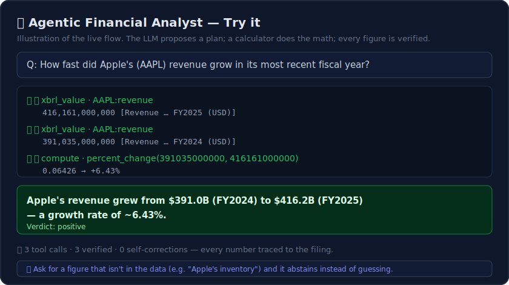
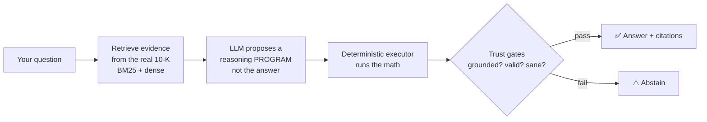

# 📊 Agentic Financial Analyst

[](https://github.com/ChaitanyaChilukuri663/Agentic-financial-analyst/actions/workflows/ci.yml)

**Ask a question about a company's financial filing and get an answer you can trust — every
number is pulled from the filing, computed by a calculator (not the AI), cited to its source,
and verified. If it can't verify a figure, it says so instead of guessing.**



<!-- To use a real recording instead: capture a GIF of the "Try it" tab, save it as
docs/demo.gif, and change the line above to:  -->

---

## The problem

Financial analysts spend hours digging numbers out of 100–300 page SEC filings and computing
ratios by hand. The obvious shortcut — *paste the filing into ChatGPT* — fails three ways:

| ❌ Too big | ❌ Made-up numbers | ❌ Bad arithmetic |
|---|---|---|
| A full 10-K doesn't fit in the model's context window. | The model hallucinates figures that *look* right. | Even with the right numbers, it miscalculates. |

## The idea

The language model **never produces a number.** Instead it proposes a **reasoning program**
— e.g. `subtract(5829, 5735), divide(#0, 5735)` — and a **deterministic engine executes the
math.** Every operand is traced back to the filing (or the company's official XBRL data), and
the result must pass trust gates — otherwise the system **abstains.**

This is the published *Program-of-Thoughts / PAL* idea (separate reasoning from computation),
hardened here with retrieval over real filings, operand-grounding, abstention gates, and an
agent that orchestrates it across companies.



The **Phase-2 agent** wraps this engine as a verified tool: in a hand-rolled *plan → act →
observe → revise* loop it picks tools (`xbrl_value`, `compute`, `passage`) across one or more
companies, self-corrects on failures, and writes a cited report — **an agent that can't
fabricate its numbers,** because every figure routes through a verified tool.

## Results

Every claim is backed by a real evaluation ([full details](evals/results.md)):

| What | Result |
|------|--------|
| **Deterministic executor** | reproduces **99.5%** of 8,281 expert FinQA programs — with **zero LLM** |
| **Determinism payoff** | program + executor beats the LLM doing its own math by **~8 points on multi-step** problems |
| **Real-filing ingestion** | parses a live 10-K → 23 sections, 53 tables (49 unit-aware), 24,852 XBRL facts |
| **Hybrid retrieval** | recall@5 **85.6%** / hit@5 **94%** — beats BM25-only and dense-only |
| **Abstention gates** | lift answer precision **60% → 64.5%** with **0% false-abstentions** |
| **Agent benchmark** | 23 labelled questions: **19/19** answer accuracy, **4/4** abstention, **100% faithful** — every number in every answer traces to a verified figure ([details](evals/agent_results.md)) |

## Demo

```bash
pip install -e ".[demo]"
cp .env.example .env          # add your Azure OpenAI endpoint + key

streamlit run ledgerlens/ui/app.py          # ask about real companies
uvicorn ledgerlens.api.app:app --reload     # JSON API at /docs
```

The UI streams each step live (look up → compute → verify) and plots a revenue trend for the
companies you ask about. The hosted demo covers **AAPL, MSFT, NVDA, GOOGL, AMZN, META** from
committed real-filing bundles (SEC blocks cloud IPs, so bundling keeps the demo reliable); a
local run fetches any ticker live from SEC EDGAR. See [DEPLOY.md](DEPLOY.md) for free hosting.

**Try these:**

- *How fast did Apple's (AAPL) revenue grow in its most recent fiscal year?* → +6.4%
- *Which grew revenue faster last year, NVIDIA (NVDA) or Microsoft (MSFT)?* → NVIDIA (65% vs 15%)
- *What was Amazon's (AMZN) net income last year?* → a cited figure straight from XBRL
- *What was Apple's (AAPL) inventory last year?* → **it abstains** — that figure isn't in the
  demo data, and the system declines rather than guess.

> **Design notes:** the *why* behind each decision (program-of-thoughts, no LangChain, abstain
> on trustworthy signals, discover-the-latest-year) is in **[docs/DESIGN.md](docs/DESIGN.md)**.

## Tech

Python 3.12 · hand-rolled multi-provider LLM client (Azure OpenAI `gpt-4.1-mini` +
`text-embedding-3-small`; structured tool-calling → Pydantic) · real SEC EDGAR ingestion
(HTML/iXBRL tables + XBRL facts) · hybrid retrieval (BM25 + dense, RRF) · pure-Python program
executor · FastAPI + Streamlit · **no LangChain** (the agent loop is hand-rolled) · ruff +
pytest + GitHub Actions CI.

```bash
pip install -e ".[dev]"
ruff check .        # lint
pytest              # 75 tests, fully offline (LLM mocked — no keys needed)
```

## Datasets & attribution

- **FinQA** — Chen et al., 2021 (numerical reasoning over financial reports), used for evaluation.
- **SEC EDGAR** — public company filings (10-K HTML/iXBRL + XBRL company facts).

No dataset content is redistributed in this repo. Code is MIT-licensed ([LICENSE](LICENSE)).
